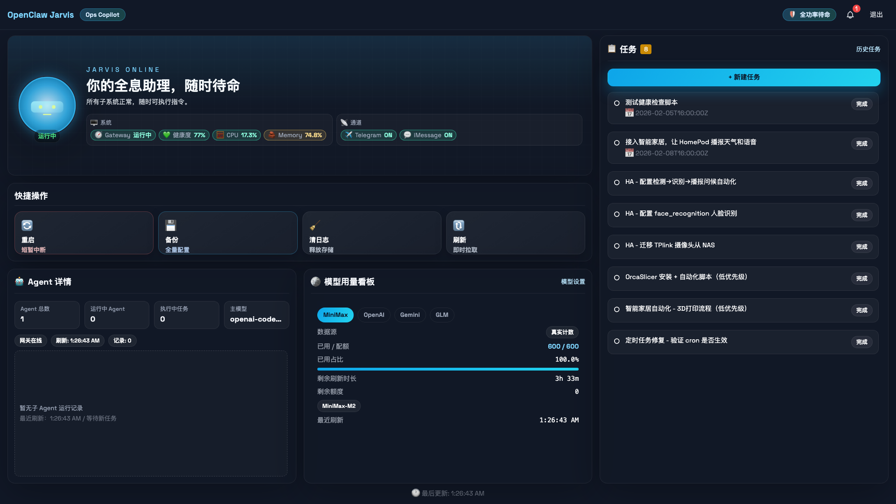

# Openclaw 贾维斯看板

OpenClaw 多 Agent 实时监控面板（FastAPI + Vue）。

## 预览



## 功能
- 系统状态：Gateway、CPU、Memory、通道状态
- 任务：本地待办/历史任务
- 模型用量看板：MiniMax + OpenAI(GPT) + Gemini + GLM
- 模型配置页面：在网页内保存 API Key 并验证连接

## 5 分钟启动（新手）

### macOS（推荐）
1. 双击 `/Users/macmini/openclaw/openclaw-dashboard/scripts/install-dashboard.command`
2. 安装完成后打开终端执行：
```bash
cd /Users/macmini/openclaw/openclaw-dashboard
source .venv/bin/activate
./start.sh
```
3. 浏览器打开 `http://localhost:18790`
4. 默认账号：`admin` / `admin123`
5. 首次登录后建议立即修改密码

### Linux
```bash
cd /Users/macmini/openclaw/openclaw-dashboard
bash scripts/install-dashboard.sh
source .venv/bin/activate
./start.sh
```

### Windows (PowerShell)
```powershell
cd /Users/macmini/openclaw/openclaw-dashboard
powershell -ExecutionPolicy Bypass -File .\scripts\install-dashboard.ps1
.\.venv\Scripts\Activate.ps1
python .\server.py
```

## 模型用量如何配置
1. 登录后进入主页面
2. 在“模型用量看板”卡片右上角点击 `模型设置`
3. 按需填写：MiniMax / OpenAI / Gemini / GLM 的 API 信息
4. 点 `验证`，通过后点 `保存配置`

### 各模型说明
- MiniMax：支持真实计数（已用/配额/占比）
- OpenAI(GPT)：支持 Usage API 请求量统计
- Gemini：当前展示状态摘要（计数源待接入）
- GLM：当前展示状态摘要（计数源待接入）

## 配置文件
- 环境变量示例：`/Users/macmini/openclaw/openclaw-dashboard/.env.example`
- 实际环境变量：`/Users/macmini/openclaw/openclaw-dashboard/.env`
- 模型集成配置：`~/.openclaw/dashboard_integrations.json`

## 常见问题
- `Invalid or expired token`：重新登录即可
- 页面无数据：确认 Gateway 进程在运行
- MiniMax 空数据：检查 GroupId / Quota URL / API Key 是否正确
- API Key 安全：前端只显示掩码，密钥保存在本机文件

## 开发命令
```bash
cd /Users/macmini/openclaw/openclaw-dashboard/frontend
npm run dev
```

```bash
cd /Users/macmini/openclaw/openclaw-dashboard
source .venv/bin/activate
python server.py
```

## 支持项目

如果这个项目对你有帮助，欢迎请我喝杯咖啡。


